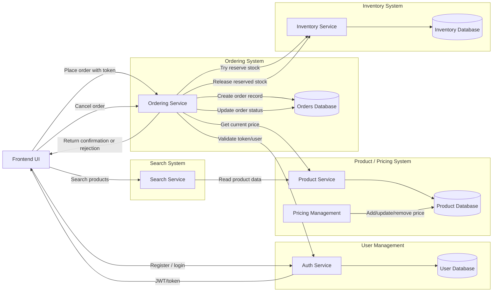

# Microservice Architecture Plan

This project should start with the Product Service. It owns the catalog and
current pricing data that the other commerce services need before they can
perform useful work.

## Architecture

## Start Here

Build the Product Service first because it has high reuse and low dependency
complexity. Search depends on product data, Ordering depends on product details
and current prices, and Inventory should reference product IDs without owning
catalog metadata.

Starting with Product Service creates a stable catalog contract before adding
stock reservation, order creation, authentication, or search indexing.

## Product Service Responsibilities

- Store product identity, metadata, and catalog records.
- Expose product lookup by ID or SKU.
- Expose current product price data for order creation.
- Provide product data for Search Service reads or indexing.
- Support price updates through the Product / Pricing boundary.

## How Other Services Use Product Service

- Search Service reads product data from Product Service.
- Ordering Service fetches product details and current prices before creating an order.
- Inventory Service references product IDs but does not own product names, descriptions, or prices.
- Pricing Management adds, updates, or removes price data through the Product / Pricing system.
- Auth Service remains independent and only handles user registration, login, and token validation.

## Recommended Build Order

~~1. Product Service~~
~~2. Inventory Service~~
3. Ordering Service
4. Auth Service
5. Search Service
6. Pricing Management split or refinement